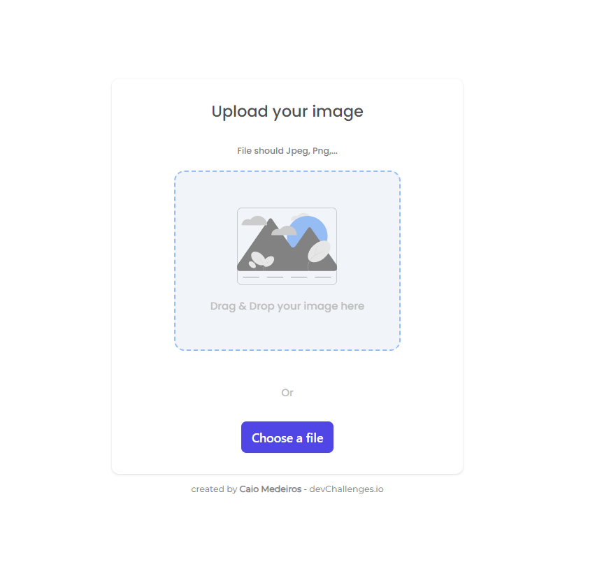

<h1 align="center">Image Uplaoder</h1>

<div align="center">
   Solution for a challenge from  <a href="http://devchallenges.io" target="_blank">Devchallenges.io</a>.
</div>

<div align="center">
  <h3>
    <a href="https://imageuploader-frontend.vercel.app/">
      Demo
    </a>
    <span> | </span>
    <a href="https://github.com/caiomed03/imageuploader-frontend">
      Solution - Frontend
    </a>
    <span> | </span>
    <a href="https://github.com/caiomed03/imageuploader-backend">
      Solution - Backend
    </a>
    <span> | </span>
    <a href="https://devchallenges.io/challenges/O2iGT9yBd6xZBrOcVirx">
      Challenge
    </a>
  </h3>
</div>

<!-- TABLE OF CONTENTS -->

## Table of Contents

- [Overview](#overview)
  - [Built With](#built-with)
- [Features](#features)
- [How to use](#how-to-use)
- [Contact](#contact)
- [Acknowledgements](#acknowledgements)

<!-- OVERVIEW -->

## Overview



Introduce your projects by taking a screenshot or a gif. Try to tell visitors a story about your project by answering:

- Where can I see your demo?<br>
The demo is available in Vercel at [Demo](https://imageuploader-frontend.vercel.app/)
- What was your experience? 
<br>This project was a great opportunity to learn more about the Vite framework, Tailwind CSS and specially consolidate advanced React concepts. I also learned a lot about the FastAPI framework .
- Your wisdom? :)
<br>It's important to have a good understanding of the technologies you are using. I had to spend a lot of time reading the documentation of the frameworks I used, but it was worth it.

### Built With

<!-- This section should list any major frameworks that you built your project using. Here are a few examples.-->
#### Frontend
- [React](https://reactjs.org/)
- [Vite](https://vitejs.dev/)
- [Tailwind](https://tailwindcss.com/)

#### Backend
- [FastAPI](https://fastapi.tiangolo.com)

## Features

<!-- List the features of your application or follow the template. Don't share the figma file here :) -->

This application/site was created as a submission to a [DevChallenges](https://devchallenges.io/challenges) challenge. The [challenge](https://devchallenges.io/challenges/O2iGT9yBd6xZBrOcVirx) was to build an application to complete the given user stories.

- [✔] User story: I can drag and drop an image to upload it
- [✔] User story: I can choose to select an image from my folder
- [✔] User story: I can see a loader when uploading
- [✔] User story: When the image is uploaded, I can see the image and copy it
- [✔] User story: I can choose to copy to clipboard the link of the image

## How To Use

<!-- Example: -->

To clone and run this application, you'll need [Git](https://git-scm.com) and [Node.js](https://nodejs.org/en/download/) (which comes with [npm](http://npmjs.com)) installed on your computer. From your command line:

```bash
# Clone this repository
$ git clone https://github.com/caiomed03/imageuploader-frontend.git

# Install dependencies
$ npm install

# Run the app in dev mode
$ npm run dev
```

## Acknowledgements

- [Tailwind CSS](https://tailwindcss.com/docs)
- [Vite](https://vitejs.dev/guide)
- [FastAPI](https://fastapi.tiangolo.com/)

## Contact
- GitHub [@caiomed03](https://{github.com/caiomed03})
- LinkedIn [@Caio Medeiros Carvalho](https://www.linkedin.com/in/caiomed03/)
